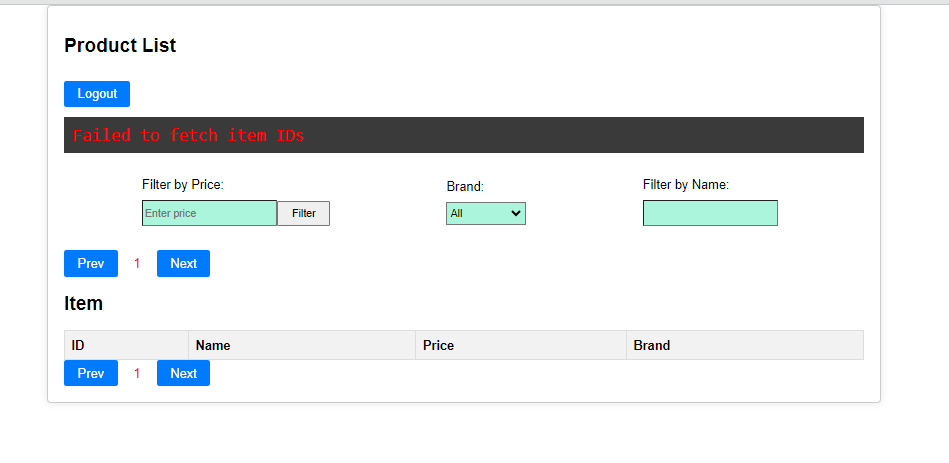
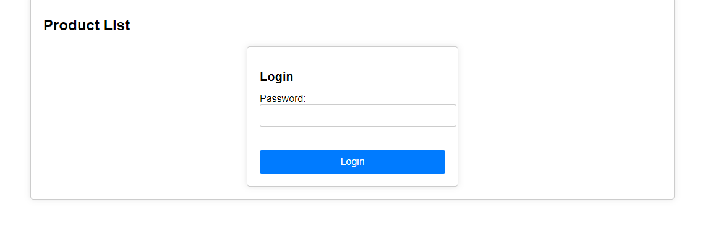
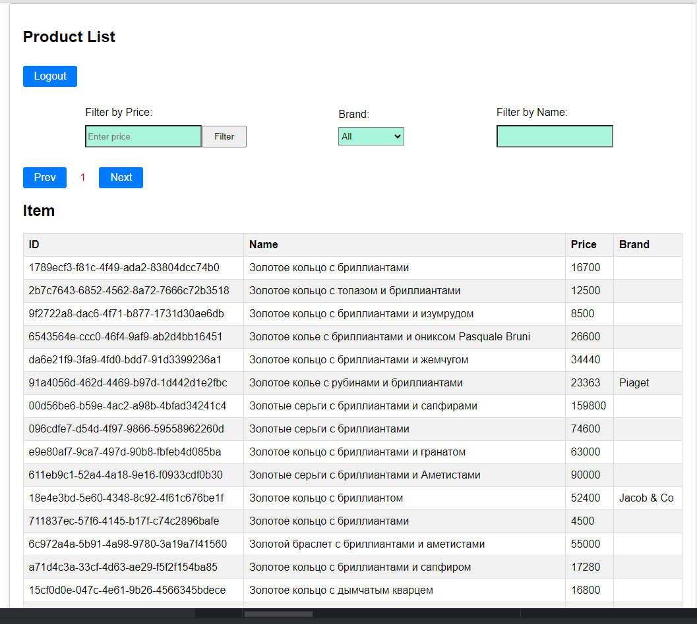

# Задание

Используя предоставленный апи создать страницу, которая отображает список товаров.  
Для каждого товара должен отображаться его id, название, цена и бренд.

## Требования:
* выводить по 50 товаров на страницу с возможностью постраничного перехода (пагинация) в обе стороны.
* возможность фильтровать выдачу используя предоставленное апи по названию, цене и бренду

Если API возвращает дубли по id, то следует их считать одним товаром и выводить только первый, даже если другие поля различаются.
Если API возвращает ошибку, следует вывести идентификатор ошибки в консоль, если он есть и повторить запрос.

Задание можно выполнять на **React** или на **нативном JS**.  
Оцениваться будет правильность работы сайта и качество кода.  
**Внешний вид** сайта оставляем на Ваше усмотрение.

Пароль для доступа к апи: **Valantis**  
API доступно по адресам:  
* http://api.valantis.store:40000/
* https://api.valantis.store:41000/  

[Документация по работе с **API** прилагается](https://github.com/ValantisJewelry/TestTaskValantis/blob/main/API.md)

## Форма подачи:
Выполненное задание разместите на **github pages** или аналогичном сервисе.  
В сообщении на hh отправить ссылку на сайт и на исходник.  
Работы без ссылки на рабочий проект рассматриваться не будут.

# Приложение 

API `http://api.valantis.store:40000/` частенько выдает ошибки поэтому реализован вывод ошибки прфмо на страницу в специальный элемент

# Запуск приложение
Склонируйте репозиторий и установите все зависиости командоу: <pre><code>`npm isnstall`</code></pre> 
Запустите командой: <pre><code>`npm start`</code></pre> 

Для получения списка товаров нужно создать токен аутентификации введя пароль <pre><code>`Valantis`</code></pre> 

***Аутентификация запросов происходит за счет авторизационной строки, которая передается в параметре заголовка X-Auth. Значение X-Auth формируется по следующему шаблону: md5(пароль_таймштамп)***  

Если все прошло успешно вам предоставится списко товаров:

Дальше можно польоваться фильтрами сортировки! 